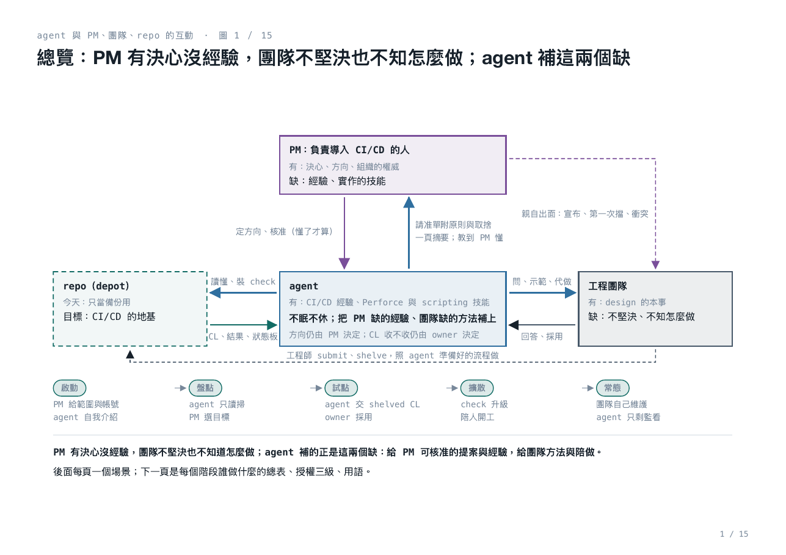
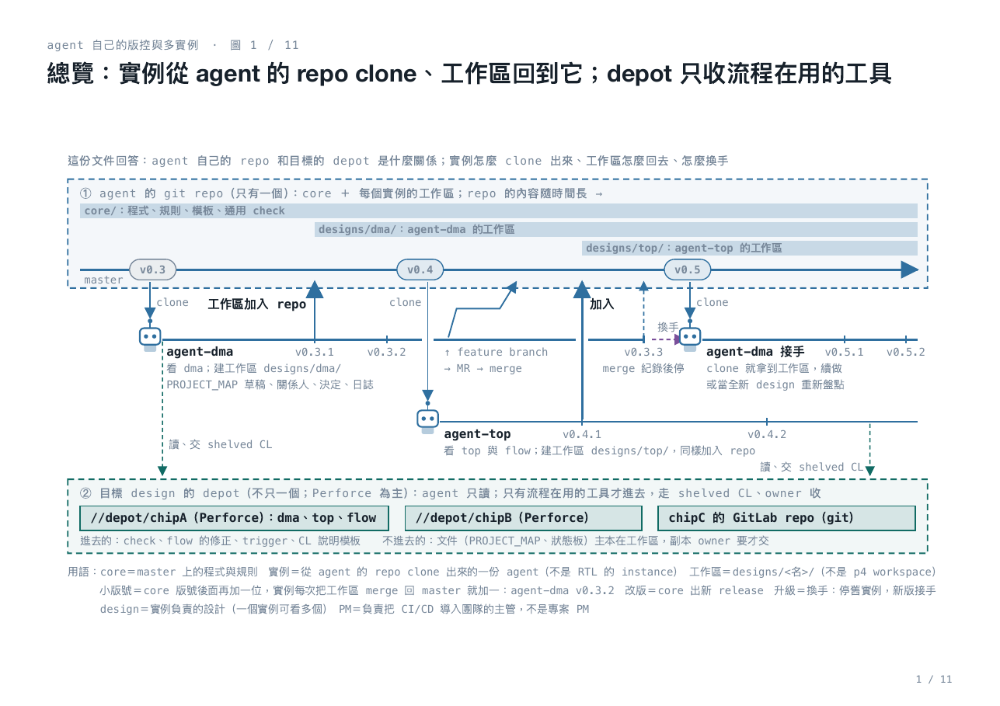

# CI/CD Mentor Agent 啟動包

這一包是給**公司內網**用的。在一個全新的 repo 與 session 裡，由內網的 Claude Code 和一位 PM 接手，把 CI/CD mentor agent 做出來、部署、跑起來。這包只講「為什麼、要做成什麼樣、行為的規矩、先做哪一步、哪些事要人決定」；不帶程式碼，不選模型與部署方式——那些是內網決定的事。

這包是在公司外的一個規劃用 repo 裡討論出來的（2026-10-08 到 10-09）；那個 repo 不是 agent 的 repo，agent 的 repo 從這一包開始建。

## 一句話

在 IC 設計團隊導入迭代式開發與 CI/CD 的 AI agent。agent **自主運行**：觀察 depot 與團隊、發現問題、提案、動手、回報，不等指令；**方向由一位人類 PM 掌握**：agent 形成的每個方針，PM 弄懂了才核准。PM 指負責把 CI/CD 導入團隊的人，不是 project 的 PM；PM 是角色，由技術主管起頭、之後交棒，可以多位 PM 各推一部分。

## 四張圖看完整個構想

每張是一份圖形文件的第 1 頁；後面的 PDF 是全文。

**1. 地基：AI 的三種效益站在同一塊地基 CI/CD 上，而這塊地基現在是空的**（[為什麼非要 CI/CD](01-why/loops-and-ai-multiplier.pdf)）

**2. 誰來做、怎麼一起做：PM 有決心沒經驗，團隊不堅決也不知怎麼做；agent 補這兩個缺**（[互動場景](03-procedures/agent-pm-team-repo-interactions.pdf)）

**3. 進到一個目錄做什麼：七個檢查對六個原則，不過就做 patch，由 owner 決定收不收**（[進到陌生的 workspace](03-procedures/agent-entering-unknown-workspace.pdf)）

**4. agent 自己怎麼活、怎麼長：實例從 agent 的 repo clone、工作區回到它；depot 只收流程在用的工具**（[agent 自己的版控與多實例](07-build-brief/agent-own-version-control-and-instances.pdf)）

串起來一句話：AI 的效益要靠 CI/CD 這塊地基，而地基現在是空的；PM 有決心沒經驗、團隊不堅決也不知怎麼做，agent 補這兩個缺，四方這樣互動；agent 進到任一目錄就做這三步；而 agent 本身這樣版控、clone、換手。為什麼要這樣搭檔，在 [AI agent 與人類 PM 搭檔](01-why/why-cicd-needs-ai-agent-and-pm.pdf)；現狀的細節（版控只當備份會長出哪些問題）在 [把版控當備份的團隊](02-diagnosis/team-treating-vc-as-backup.pdf)。

## 七份投影片的名字

投影片的檔名講它回答什麼問題；頁眉（kicker）和標題是另一套說法；10、11 裡偶爾用舊名或標題稱呼它們，對照如下。

| 檔名 | 文件標題 | 頁眉 | 舊名或別稱 |
|---|---|---|---|
| 01-why/why-cicd-needs-ai-agent-and-pm | AI agent 與人類 PM 搭檔 | CI/CD Mentor Agent | ai-agent-and-pm-make-cicd-happen |
| 01-why/loops-and-ai-multiplier | 為什麼非要 CI/CD：查和判不交給機器，N 個 agent 等於一個 | CI/CD 的意義 | loops-need-cicd-before-ai-multiplies |
| 02-diagnosis/team-treating-vc-as-backup | 把版控當備份的團隊：depot 留住檔案，留不住答案 | 版控只當備份的團隊 | repo-as-backup-keeps-files-not-answers |
| 03-procedures/agent-entering-unknown-workspace | 進到陌生的 workspace：人或 agent 照六個原則檢查，不過就先做 patch | 進到陌生 workspace 的檢查 | check-then-patch-before-asking-owner |
| 03-procedures/agent-pm-team-repo-interactions | 互動場景：agent 補 PM 與團隊各缺的 | agent 與 PM、團隊、repo 的互動 | agent-fills-what-pm-and-team-lack |
| 07-build-brief/agent-own-version-control-and-instances | agent 自己的版控：實例從 agent 的 repo clone、工作區回到它；depot 只收流程在用的工具 | agent 自己的版控與多實例 | agent-evolves-by-release-not-self-edit |
| 07-build-brief/agent-capability-modules | agent 的基本模塊：拆成十七個各有規格的模塊，公司專屬的只有三樣 | agent 的基本模塊 | — |

## 這包裡有什麼，照什麼順序讀

| 順序 | 檔案 | 給誰 | 讀完要能 |
|---|---|---|---|
| 1 | [CLAUDE.md](CLAUDE.md) | 內網的 Claude Code | 說出這個專案的目的與框架，以及自己的工作規則 |
| 2 | [glossary.md](glossary.md) | 所有人 | 用語一致：PM、owner、實例、工作區、shelved CL、check、manifest… |
| 3 | [01-why/](01-why/) | PM、sponsor | 為什麼要做、為什麼一直做不起來、AI agent 與 PM 怎麼搭 |
| 4 | [02-diagnosis/](02-diagnosis/) | PM、團隊；Claude Code 讀 [sixteen-problems.md](02-diagnosis/sixteen-problems.md) | 把版控當備份的團隊長什麼樣、十六個問題怎麼歸成六個原則；沙盒要埋的清單 |
| 5 | [04-principles.md](04-principles.md) | 所有人 | 六個原則與檢驗、九條做法、版控的常規、review 規矩 |
| 6 | [03-procedures/](03-procedures/) | Claude Code、PM | agent 進到一個目錄做什麼；四方在每個階段的互動 |
| 7 | [05-behavior-guidelines.md](05-behavior-guidelines.md) | Claude Code（這是 agent 的規矩） | 可以直接照著做的行為指導原則，每條指回依據 |
| 8 | [06-pm-handbook.md](06-pm-handbook.md) | PM | PM 的功課、要談的資源與人、路線圖與停損、怎麼讀請示、交棒 |
| 9 | [07-build-brief.md](07-build-brief.md)、[07-capabilities.md](07-capabilities.md)、[07-build-brief/](07-build-brief/) | Claude Code | 做成什麼：元件、介面、兩種 repo 與三層、實例與換手、沙盒驗收、MVP 的順序；能力拆成哪些模塊——要模組化、分層、怎麼切是規則，十七個模塊與介面是建議 |
| 10 | [08-templates/](08-templates/) | Claude Code | PROJECT_MAP、狀態板、CL 說明、需求、請示、日誌、訊息的骨架 |
| 11 | [09-open-decisions.md](09-open-decisions.md) | PM、sponsor、CAD | 公司要先決定的事，附預設值 |
| 12 | [10-decision-log.md](10-decision-log.md) | 想知道為什麼這樣定的人 | D1–D13 與理由 |
| 13 | [11-research/](11-research/) | 附錄 | 業界實踐與風險、顧問類比、迴圈與 AI 倍數，附來源 |

## 第一週做什麼

1. **PM** 讀 [06-pm-handbook.md](06-pm-handbook.md)，拿 [09-open-decisions.md](09-open-decisions.md) 去談最前面幾件：design 資料能不能給 LLM、用哪個模型；agent 的 Perforce 與 slack 帳號（先只讀）；sponsor 是誰；第一個自願的試點團隊。這幾件沒談好，agent 動不了。
2. **內網的 Claude Code** 照 [CLAUDE.md](CLAUDE.md) 裡的讀序讀完；照 [07-build-brief.md](07-build-brief.md) 的第一步建**沙盒 depot**（埋 [02-diagnosis/sixteen-problems.md](02-diagnosis/sixteen-problems.md) 的十六種問題），讓第一版 agent 在沙盒上長出來。
3. 沙盒三項驗收過了（偵測、提案、不可做的事）、第 1 步的資源談好了，agent 才以只讀帳號上真實的 depot，從盤點開始。

## 這包不做的

- 不帶程式碼、不選模型與部署方式、不設計 Perforce trigger 的程式碼：這些由內網的 Claude Code 提案、PM 核准，記進決定紀錄。
- 不帶投影片的產生器：投影片只有 PDF 與逐頁 PNG。

## 怎麼維護這包

- 這包進了 agent 的 repo 之後，就是 core 的文件層：改它走 MR，和程式一樣。
- 決定了什麼，記進 [10-decision-log.md](10-decision-log.md)（只增不改）；[09-open-decisions.md](09-open-decisions.md) 的項目定了就移到 10。
- 模塊的清單與介面（[07-capabilities.md](07-capabilities.md)）可以改、該改就改，改了記進 10；要模組化、要分層、怎麼切的規則不能改（D13）。
- 這包裡所有連結都在包內。文字裡提到的「規劃 repo」「operating model」「T 編號」是這包討論出來時的歷史脈絡，不需要也拿不到；對應關係在 [10-decision-log.md](10-decision-log.md) 的 D11。
